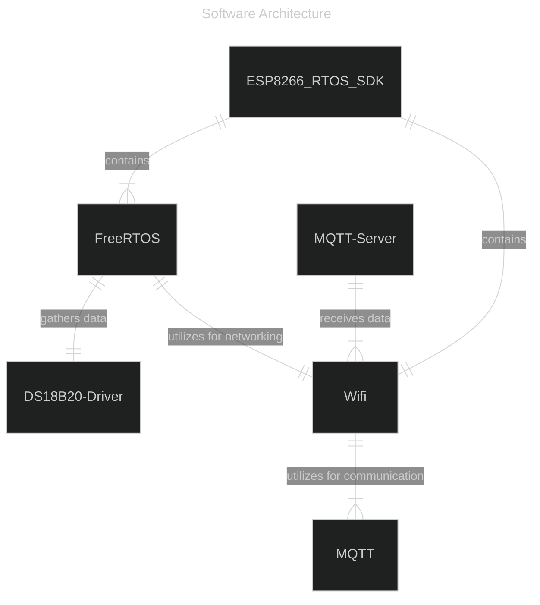
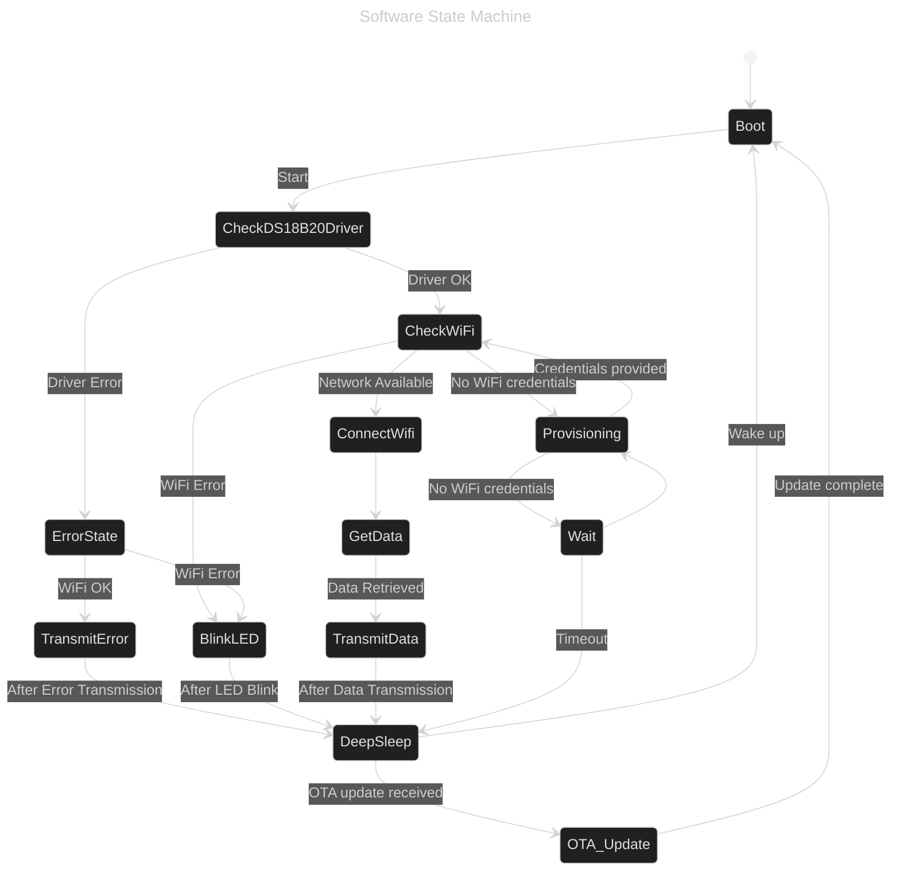

# Design Overview
## Hardware Components
- [ESP-01S](https://www.microchip.ua/wireless/esp01.pdf)
- [DS18B20](https://www.analog.com/media/en/technical-documentation/data-sheets/DS18B20.pdf)
- [LM3671](https://cdn-shop.adafruit.com/product-files/2745/P2745_Datasheet.pdf)

## ESP-01S

*ESP-01S Module. Source: en.ai-thinker.com*

The ESP-01S is a carrier board with ESP8266, developed by Ai-thinker, with onboard antenna and 5MB SPI flash. The low price, form factor,
and libraries have made it a common board for the maker community.

### ESP8266
The ESP8266 is a ultra low power 32 bit MCU, supports 80 and 160 MHz clock speed, with integrated wifi and supports FreeRTOS, and is based on Tensilia's L106 Diamond series 32 bit processor.
### Features
* 802.11 b/g/n
* Integrated low power 32-bit MCU
* Integrated 10-bit ADC
* Integrated TCP/IP protocol stack
* Integrated TR switch, balun, LNA, power amplifier and matching network
* Integrated PLL, regulators, and power management units
* Supports antenna diversity
* Wi-Fi 2.4 GHz, support WPA/WPA2
* Support STA/AP/STA+AP operation modes
* Support Smart Link Function for both Android and iOS devices
* SDIO 2.0, (H) SPI, UART, I2C, I2S, IRDA, PWM
* STBC, 1x1 MIMO, 2x1 MIMO
* A-MPDU & A-MSDU aggregation and 0.4s guard interval
* Deep sleep power <10uA, Power down leakage current < 5uA
* Wake up and transmit packets in < 2ms
* Standby power consumption of < 1.0mW (DTIM3)
* +20dBm output power in 802.11b mode
* Operating temperature range -40C ~ 125C

### Desired Features
The features of interest to me are the WiFi related ones, as well as the deep sleep (for a future battery powered version). Due to the design of the ESP01, the
other features are not easily accessible, due to the limited pins on the board.

The schematic to include the ESP-01S in the project looks like this:

## DS18B20
### Features
* Unique 1-Wire® Interface Requires Only One Port
Pin for Communication
* Reduce Component Count with Integrated
Temperature Sensor and EEPROM
  * Measures Temperatures from -55°C to +125°C
(-67°F to +257°F)
  * ±0.5°C Accuracy from -10°C to +85°C
  * Programmable Resolution from 9 Bits to 12 Bits
  * No External Components Required
* Parasitic Power Mode Requires Only 2 Pins for
Operation (DQ and GND)
* Simplifies Distributed Temperature-Sensing
Applications with Multidrop Capability
  * Each Device Has a Unique 64-Bit Serial Code
Stored in On-Board ROM

### Desired Features
The accuracy and 1-Wire protocol make this a cheap, scalable temp sensor. It is possible to use multiple 1 wire devices in parallel, if possible.

The schematic to include the DS18B20 in the project looks like this:

## Power Supply
The goal is to have 5V USB bricks power version one of the IoT Temp Probe, so to bring it down to the 3.3V of the ESP8266, I need a linear regulator or a buck converter.

[The Wikipedia page on buck converters](https://en.wikipedia.org/wiki/Buck_converter) has a good blurb about the difference
> A buck converter or step-down converter is a DC-to-DC converter which decreases voltage, while increasing current, from its input (supply) to its output (load). It is a class of switched-mode power supply. Switching converters (such as buck converters) provide much greater power efficiency as DC-to-DC converters than linear regulators, which are simpler circuits that dissipate power as heat, but do not step up output current.[1] The efficiency of buck converters can be very high, often over 90%, making them useful for tasks such as converting a computer's main supply voltage, which is usually 12 V, down to lower voltages needed by USB, DRAM and the CPU, which are usually 5, 3.3 or 1.8 V.

This efficiency difference, as well as the temperature difference, are good reasons to select a buck converter.

For prototyping, I'm going to select the [LM3671](https://www.ti.com/lit/ds/symlink/lm3671.pdf).

A breakout board is available from [adafruit](https://www.adafruit.com/product/2745).

### LM3671
#### Features
* 16-µA Typical Quiescent Current
* 600-mA Maximum Load Capability
* 2-MHz PWM Fixed Switching Frequency (Typical)
* Automatic PFM-PWM Mode Switching
* Internal Synchronous Rectification for High
Efficiency
* Internal Soft Start
* 0.01-µA Typical Shutdown Current
* Operates from a Single Li-Ion Cell Battery
* Only Three Tiny Surface-Mount External
Components Required (One Inductor, Two
Ceramic Capacitors)
* Current Overload and Thermal Shutdown
Protection
* Available in Fixed Output Voltages and Adjustable
Version

### Desired Features
The LM3671's features, like its low quiescent current and high efficiency, make it an ideal choice for powering the ESP8266,
ensuring minimal energy wastage and optimal performance in a (possible future) battery-operated setup. The accessibility of having a breakout board and open source hardware
increase the component's desirability. 

The ESP8266 Draws 300mA max, during WiFi transmissions, according to multiple sources on the internet. The data sheet says 170 mA max. I'll err on the side of caution
The DS18B20 draws 4mA, which is negligible. This gives me room to put LEDs on, if I so desire.

The schematic to include the LM3671 breakout in the project looks like this (thanks to adafruit):

## Conclusion: Hardware
Until the buck converter I've ordered arrives, I've substituted my Arduino for the power supply and UART programmer.

An overview of that looks something like:

### Side Note: Decoupling Capacitors
Decoupling capacitors are something I've heard of, but have never had to implement myself. The goal is to filter out fluctuations in what should be
steady DC power. Convention shows other people put 100nF capacitors as close to possible to ICs to send noise to ground.

A quick high level overview from TI, that I found helpful:


## Software Components
- [ESP8266 RTOS SDK](https://github.com/espressif/ESP8266_RTOS_SDK/tree/master)
  - FreeRTOS
  - WiFi
    - Provisioning
    - WPA/WPA2
  - OTA Updates
- DS18B20 Driver
  - Many possible drivers exist as open source libraries, that will be evaluated after the prototype process.
    - StanislavLakhtin's [esp-idf-onewire](https://github.com/StanislavLakhtin/esp-idf-onewire/)
    - Tom-TheBrand's [esp32_onewire](https://github.com/Tom-TheBrand/esp32_onewire)
    - PaulStoffregen's [OneWire](https://github.com/PaulStoffregen/OneWire)
    - DavidAntliff's [esp32-ds18b20](https://github.com/DavidAntliff/esp32-ds18b20) and [esp32-owb](https://github.com/DavidAntliff/esp32-owb)
- MQTT
  - I plan to use [ESP CoreMQTT](https://github.com/espressif/esp-freertos-coremqtt)

### ESP8266 RTOS SDK
The ESP8266 RTOS SDK, hosted on [GitHub](https://github.com/espressif/ESP8266_RTOS_SDK/tree/master), is an IoT development framework SDK on top of a FreeRTOS port to the ESP8266EX, in the style of the ESP-IDF, 
which is the popular development environment for the ESP32 devices by Espressif.
Included in it are many examples, including those that show capabilities for a WiFi client, provisioning WiFi, WPA/WPA2 security, and OTA updates, making it perfect for my project.

#### Key Features:
- **RTOS Foundation**: Built on FreeRTOS, the SDK facilitates concurrent handling of multiple tasks, crucial for complex IoT applications.
- **Development Environment Consistency**: Aligns with ESP-IDF, Espressif’s official development framework for ESP32, offering a familiar environment for those accustomed to Espressif's platforms.
- **Flexible Build System**: Utilizes a Python-based build system layered over CMake and make, granting developers flexibility and precision in the compilation process.
- **Comprehensive Development Tools**: Includes a full suite of tools, libraries, and documentation, streamlining IoT application development.
- **Rich Libraries and APIs**: Provides extensive libraries and APIs for GPIO, UART, I2C, SPI, PWM, and more, facilitating seamless hardware interactions.
- **WiFi Capabilities**: 
  - Supports the creation of WiFi clients and Access Points for network connectivity.
  - Features WiFi provisioning and secure connections using WPA/WPA2 protocols.
- **OTA Updates Support**: Enables Over-The-Air updates, crucial for remote firmware upgrades and maintenance.
- **Power Management**: Offers functions and tools for efficient power usage, critical for battery-operated or energy-efficient devices.
- **Customizability and Scalability**: Allows for extensive customization and scalability, adapting to a wide range of IoT application requirements.

By leveraging the ESP8266 RTOS SDK, the project aims to create an efficient, secure, and robust system for temperature measurement and data transmission. This SDK aligns with the project's objectives of utilizing existing hardware and software resources, ensuring scalability, and providing a reliable foundation for future enhancements.

### DS18B20 Driver
For interfacing with the DS18B20 temperature sensor, various open-source driver options are available. After the prototyping phase, the most suitable driver will be selected based on performance and compatibility. The repos to be 
evaluated are:
- [StanislavLakhtin's esp-idf-onewire](https://github.com/StanislavLakhtin/esp-idf-onewire/): A driver specifically designed for ESP-IDF, offering seamless integration with ESP32 and potentially adaptable for ESP8266.
- [Tom-TheBrand's esp32_onewire](https://github.com/Tom-TheBrand/esp32_onewire): Another ESP32-focused driver, known for its simplicity and effectiveness.
- [PaulStoffregen's OneWire](https://github.com/PaulStoffregen/OneWire): A widely-used, versatile driver that supports a range of microcontrollers.
- [DavidAntliff's esp32-ds18b20](https://github.com/DavidAntliff/esp32-ds18b20) and [esp32-owb](https://github.com/DavidAntliff/esp32-owb): A comprehensive set of drivers and libraries providing robust support for DS18B20 on ESP32 platforms.

### MQTT
For the MQTT protocol implementation, the plan is to utilize the [ESP CoreMQTT](https://github.com/espressif/esp-freertos-coremqtt) library. This library is ESP's fork of CoreMQTT, and has the following features:
- **Seamless Integration with FreeRTOS**: Designed to work effortlessly with the FreeRTOS ecosystem, ensuring smooth multitasking and reliable performance.
- **Lightweight and Efficient**: The library is optimized for minimal resource usage, making it ideal for constrained environments like the ESP8266.
- **Support for MQTT Protocols**: Fully supports MQTT communication protocols, essential for IoT data transmission.
- **Robust and Reliable**: Known for its stability and reliability in handling MQTT connections and data transfer.
- **Flexibility in Application**: Can be easily integrated into a variety of IoT projects, allowing for versatile use cases.

By integrating these software components, the project will benefit from robust sensor interfacing, efficient communication protocols, and reliable performance, forming a solid foundation for the IoT Temperature Probe application.

### Architecture
The IoT Temperature Probe architecture depicted in the ER diagram is based upon the ESP8266 RTOS SDK, which contains FreeRTOS and WiFi components. FreeRTOS utilizes WiFi for networking and also interfaces with the DS18B20-Driver to gather temperature data. Additionally, WiFi is a vital component within the ESP8266 RTOS SDK and is used by MQTT for communication. Temperature data is then sent to the MQTT Server via WiFi.

### State Machine
The state diagram represents the operational flow of the IoT Temperature Probe. It starts with a boot process, checking the DS18B20 driver, and then verifying WiFi connectivity. If the driver is okay, it proceeds to check WiFi; if not, it enters an error state. WiFi checks lead to data gathering or provisioning for credentials. Data is then transmitted or errors are indicated through blinking LEDs. The system enters deep sleep after transmission or error handling, with provisions for waking up and handling OTA updates.

## Conclusion and Next Steps
With the key hardware components selected and the software environment established, the next phase involves prototyping and integrating these elements. Upcoming steps include connecting all hardware, and then testing the DS18B20 sensor with the ESP-01S and implementing the initial firmware with MQTT communication.
