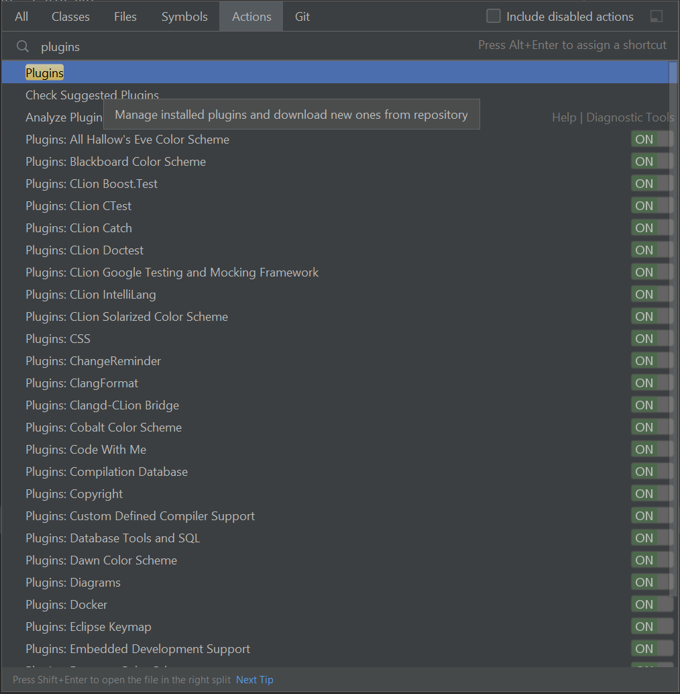
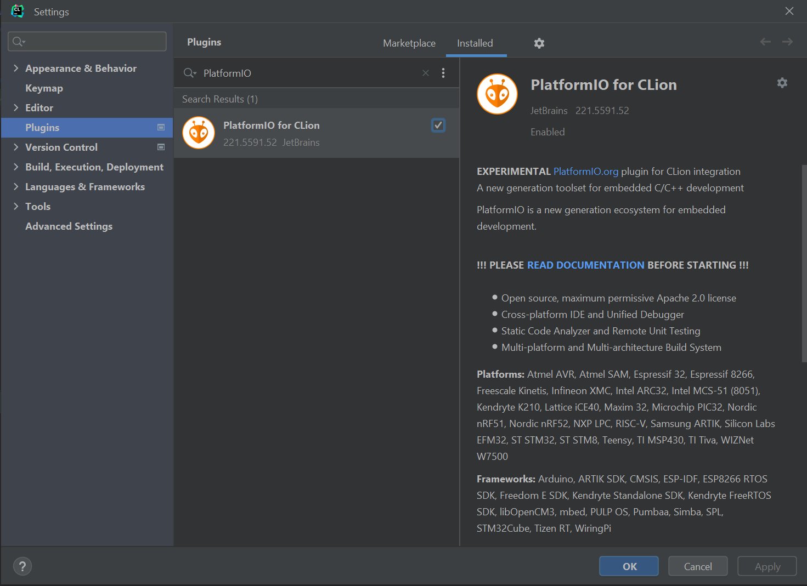
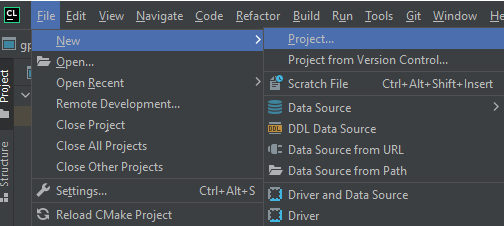
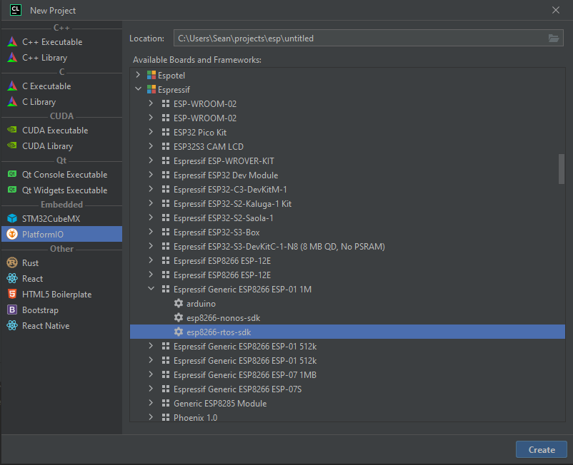
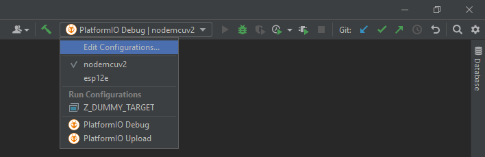
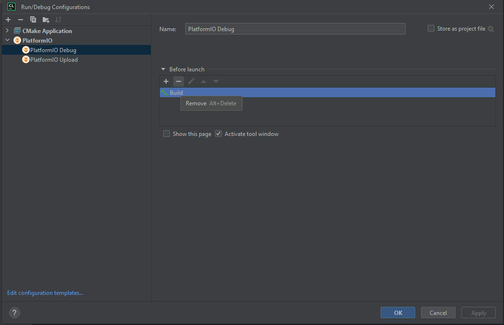

I could have named this something different. I did not.

# Setting up PlatformIO with Clion
PlatformIO has documentation [here](https://docs.platformio.org/en/latest/integration/ide/clion.html), but I will walk
through it.

1. Open the CLion plugin menu using `ctrl+shift+A` and type `plugins`




2. Install the platformIO plugin, by searching for `PlatformIO`



# Configuring PlatformIO with CLion

PlatformIO automatically downloads configurations for a project if it doesn't already have them.

1. Create a new PlatformIO project: `File->New->Project...`



2. Select `PlatformIO`->`Espressif`->`Espressif Generic ESP8266 ESP-01 1M`->`esp8266-rtos-sdk`

***Note: Make sure to check the onboard memory, and that it matches***



The PlatformIO project should be configured

## Setting up an existing project
1. PlatformIO is nice enough to supply us with examples at `https://github.com/platformio/platform-espressif8266`.
Clone that baby wherever you want, and we can get started.


2. Open your blinky folder example folder in clion `platform-espressif8266\examples\esp8266-rtos-sdk-blink` and 
create a clion project out of it


3. The default blinky project is set up to blink gpio16. We don't have that, and that's not where our onboard LED is. So,
we're going to replace

```c
void task_blink(void* ignore)
{
    gpio16_output_conf();
    while(true) {
    	gpio16_output_set(0);
        vTaskDelay(1000/portTICK_RATE_MS);
    	gpio16_output_set(1);
        vTaskDelay(1000/portTICK_RATE_MS);
    }

    vTaskDelete(NULL);
}
```
with
```C
void task_blink(void* ignore)
{
	GPIO_ConfigTypeDef config = {.GPIO_Pin = GPIO_OUTPUT_IO_0, 
                             .GPIO_Mode = GPIO_Mode_Output, 
                             .GPIO_Pullup = GPIO_PullUp_DIS, 
                             .GPIO_IntrType = GPIO_PIN_INTR_DISABLE};
	gpio_config(&config);
	GPIO_OUTPUT_SET(GPIO_OUTPUT_IO_0, 0);

	while(true) {
		GPIO_OUTPUT_SET(GPIO_OUTPUT_IO_0, 0);
        vTaskDelay(1000/portTICK_RATE_MS);
		GPIO_OUTPUT_SET(GPIO_OUTPUT_IO_0, 1);
        vTaskDelay(1000/portTICK_RATE_MS);
    }

    vTaskDelete(NULL);
}
```
so our onboard LED will blink.

4. We're also going to want to remove the build actions that Clion has attached to the PlatformIO actions. We want 
go to the action dropdown in the menu, and select `Edit Configurations...`



5. For each of both the `Debug` and `Upload` options, remove the build stage by selecting `build` and hit the `-` button.



# Building and Flashing
1. Select the `PlatformIO Upload` build option, and hit the play button. If all goes as planned, your build should 
and your board should be flashed

***Note: PlatformIO automatically detects upload port by default. You can configure a custom port using 
`upload_port` option in platformio.ini***