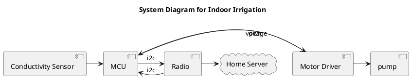

Over a year has passed since my last post. 

Time for a new project. For legal reasons, I can't touch my last idea for a year.

A new idea for a project: An indoor irrigation system.
The plan:



It's simple enough, and fits with my needs and wants.

```plantuml
@startuml
newpage

node test
node tes1

test -> test1
@enduml
```


https://github.com/simplefoc/SimpleFOCMini
https://docs.simplefoc.com/

https://feilipu.me/2011/09/22/freertos-and-libraries-for-avr-atmega/
https://github.com/feilipu/avrfreertos
