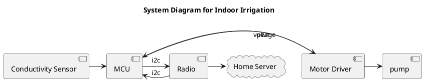

Time for a new project. For legal reasons, I can't touch my last idea for a year.

A new idea for a project: An indoor irrigation system.
The plan:

It's simple enough, and fits with my needs and wants.
