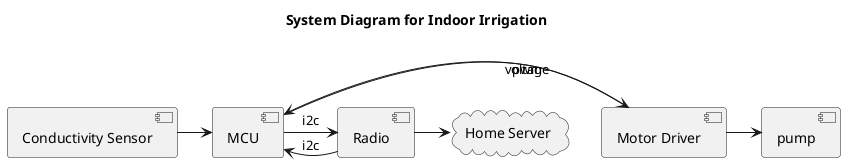

```plantuml
@startuml
title System Diagram for Indoor Irrigation
component MCU
component "Motor Driver"
component Radio
component pump
component "Conductivity Sensor"
cloud "Home Server"

MCU  -> "Motor Driver"   : pwm
"Motor Driver" -> MCU   : voltage
MCU -> Radio            : i2c
Radio -> MCU            : i2c
"Motor Driver" -> pump
Radio -> "Home Server"
"Conductivity Sensor" -> MCU
@enduml
```